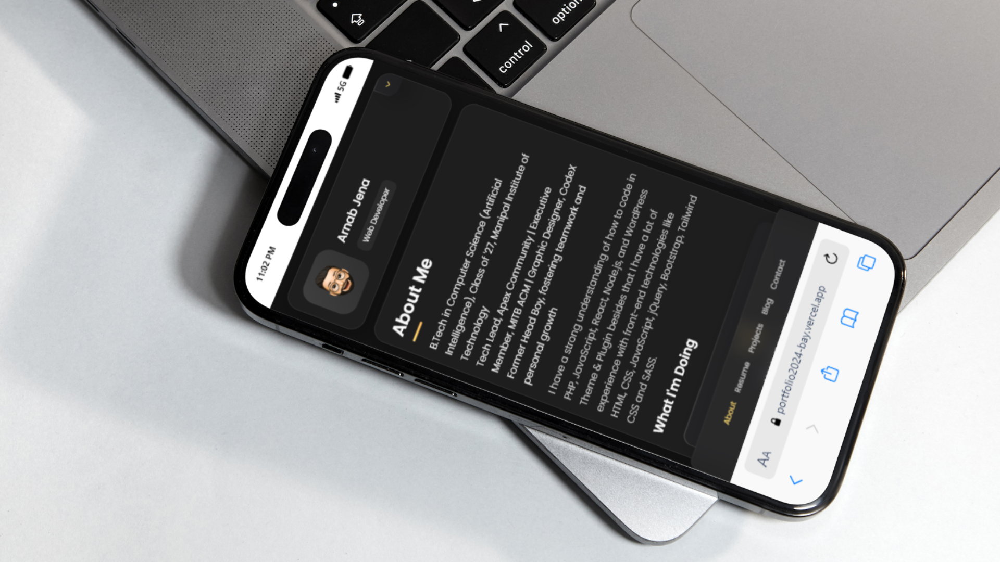
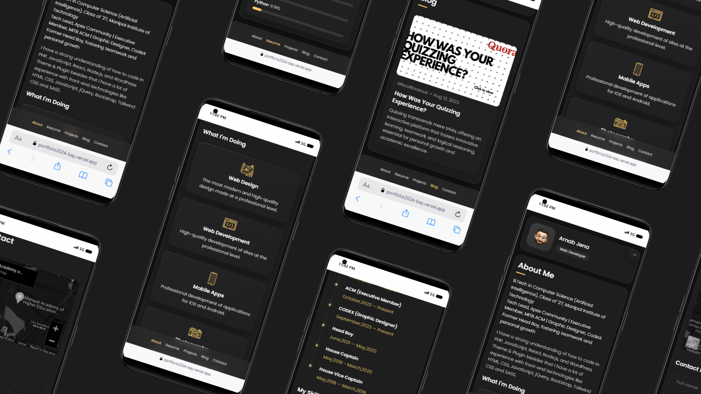

<h1 align="center">Portfolio Website</h1>
</p>

## Portfolio Website 🔗
[**Visit Now**](https://portfolio2024-bay.vercel.app/)

## 🛠️ Tech Stack
[](https://github.com/arnabjena007/Portfolio-Website/search?l=html)&nbsp;
[](https://github.com/arnabjena007/Portfolio-Website/search?l=css)&nbsp;
[](https://github.com/arnabjena007/Portfolio-Website/search?l=javascript)&nbsp;
[](https://vercel.com/)

## 🖼️ Sneak Peek of Pages



## 📬 Contact Me
- [LinkedIn](https://www.linkedin.com/in/arnabjena/)

## Features
- Clean and minimal design
- Responsive layout
- Easy to customize
- Lightweight and fast

<!-- ABOUT THE PROJECT -->

## Built With

The tech stack we will be using:

- HTML
- CSS
- JavaScript
- Bootstrap

# Contributing to Portfolio2024

Replace `<your_user_name>` with your GitHub username.

## Navigation and Setup

Navigate to the project directory 📁, add a reference(remote) to the original repository, and check the remotes for this repository:

```shell
cd portfolio2024 &&
git remote add upstream https://github.com/portfolio2024/portfolio2024.github.io.git &&
git remote -v
```
Keeping Your Local Copy Updated
Always fetch changes from the upstream repository to keep your local copy updated and merge the changes from the upstream repository to your main branch:

```shell
git fetch upstream &&
git merge upstream/main
```
Working on a New Feature
Create a new branch for your work 🌿, make necessary changes, and commit those changes:

```shell
git checkout -b your_branch_name &&
git add . &&
git commit -m "Your commit message"
```

Pushing Changes and Creating a Pull Request
Push the committed changes to your feature branch on your remote repository:

```shell
git push -u origin your_branch_name
```
After pushing your changes, create a pull request:

- Go to the GitHub page of your forked repository.
- Click on the "New pull request" button.
- Select the base branch and your feature branch for the pull request.
- Add an appropriate title and description to your pull request explaining your changes and efforts.
- Click on "Create Pull Request".
- Congratulations! You've created a pull request 🎉. Be patient while we review your code and merge the changes.

## Roadmap
See the open issues for a list of proposed features and known issues.

## License
This project is licensed under the MIT License.

## Contact
If you have any questions or concerns, feel free to email us at arnabjena2003@gmail.com 📧.

<p align="center">Made with ❤️ | Hosted on <a href="https://portfolio2024-bay.vercel.app/">Vercel</a></p>


